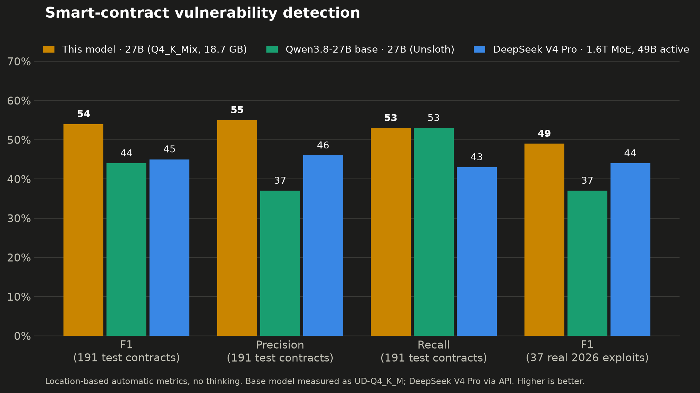
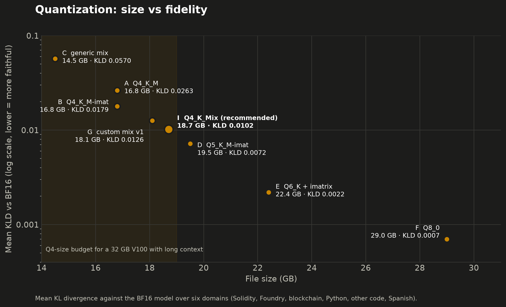

# Qwen3.8-27B-Solidity-v1

**Model weights (GGUF + LoRA): [huggingface.co/Rami8612/Qwen3.8-27B-Solidity-v1-GGUF](https://huggingface.co/Rami8612/Qwen3.8-27B-Solidity-v1-GGUF)**

A LoRA fine-tune of **Qwen3.8-27B** trained on **Solidity smart-contract audit data**, so that it handles smart contracts better than the base model. The data combines findings from professional smart-contract security audits and analyses of real-world exploits, linked to the vulnerable contract code. The repo also contains a quantization study with custom imatrix-guided GGUF mixes, built to run the model on a single 32 GB V100.

**Dataset in numbers** (train + held-out validation/test):
- **3,225 Solidity contract files**, each paired with its expected audit result: 2,998 for training, the rest held out for validation and test.
- **413 professional security audits** of DeFi protocols.
- **3,987 judged High/Medium findings**, each with root cause, attack path and fix, linked to the vulnerable code.
- **58 real-world exploits**, with the victim contracts' verified source code.
- **560 clean contract files**: in-scope files with no valid High/Medium finding after judging.
- **595 step-by-step reasoning traces** from DeepSeek V4 Pro, kept only when they reached the same findings as the human auditors.
- About **13M tokens** of training text.

This is a personal end-to-end project covering dataset construction, LoRA training, evaluation against the base model and a frontier model, quantization, and testing on real hardware.

## Model details

| | |
|---|---|
| **Developed by** | Rami8612 |
| **Model type** | Causal language model, hybrid architecture (linear + full attention), LoRA fine-tune merged into the weights |
| **Fine-tuned from** | [unsloth/Qwen3.8-27B](https://huggingface.co/unsloth/Qwen3.8-27B) |
| **Domain** | Solidity / EVM smart contracts |
| **Language** | English (general Spanish ability preserved) |
| **Formats** | GGUF (custom imatrix mixes and standard quants) + LoRA adapter |
| **License** | Apache-2.0 |
| **Version** | v1 (2026-10-03) |

## Results at a glance

On a held-out test set of 191 contracts (split by protocol, so no project appears in both train and test), compared with the **base model** and **DeepSeek V4 Pro**, a 1.6T-parameter MoE model (49B active), about 60× larger than this 27B model:



| | vs. Qwen3.8-27B base (27B) | vs. DeepSeek V4 Pro (1.6T MoE, 49B active) |
|---|---|---|
| **F1** | 0.44 → **0.54** (**+23%**) | 0.45 → **0.54** (**+20%**) |
| **Precision** | 37% → **55%** (+18 pts, **+49%**) | 46% → **55%** (+9 pts) |
| **Recall (strict)** | 53% → **53%** (same) | 43% → **53%** (+10 pts) |
| **Findings per contract** | 2.37 → 1.88 (−21%, less noise) | 1.17 → 1.88 |

On **37 real exploits from 2026** (incidents that happened after every model's training cutoff), F1 went from 0.37 (base) and 0.44 (DeepSeek) to **0.49** with the recommended quant (**+32%** vs base, **+11%** vs DeepSeek). The plain Q4_K_M build reached **0.58**. With only 37 samples, differences of a few points may be noise.

General skills were mostly preserved: Spanish Q&A stayed at 16/16, and Python coding problems with tests went from 15/16 to 14/16.

## Training

| | |
|---|---|
| Base model | [unsloth/Qwen3.8-27B](https://huggingface.co/unsloth/Qwen3.8-27B) (bf16 release of Qwen3.8-27B). Hybrid architecture: 48 linear-attention + 16 full-attention layers |
| Method | LoRA bf16 with Unsloth + TRL SFT (r=16, alpha=16, lr 1e-4 cosine, effective batch 8, 2 epochs, 750 steps), loss on responses only |
| Context | 25,600 tokens |
| Data | 2,998 examples: High/Medium findings from professional security audits (2022–2025) linked to the code, real-world exploit analyses, 515 clean-code negatives (17%), and 595 reasoning traces generated with DeepSeek V4 Pro (MIT) and filtered by rejection sampling |
| Hardware | 1× H100 NVL 94 GB, 3 h 55 min, peak VRAM 70.9 GB |
| Eval loss | 1.325 (base) → 0.834 (final), no overfitting |

Each training example is one contract file plus the expected findings: title, severity, location, root cause, attack path, impact and fix. The training data is not published.

## Training data

| Data type | Description | Examples (all splits) |
|---|---|---|
| Audit findings | Judged High/Medium findings from professional security audits, linked to the audited contract files | 2,607 |
| Real-world exploits | Post-mortem analyses of real exploits, plus the victim contract's verified source code | 58 |
| Clean contracts | Audited, in-scope files with no valid High/Medium finding; "hard" negatives preferred (files whose reported issues were judged invalid) | 560 |
| Reasoning traces | 595 step-by-step traces generated with DeepSeek V4 Pro (MIT) for thinking-mode examples, kept only when they reached the same findings as the human auditors | — |

- **Totals:** 2,998 train / 36 validation / 191 test examples, split by protocol (305 / 9 / 60 protocols), so that no project appears in more than one split.
- **Train size:** about 13M tokens.
- **Audit dates:** 2022–2025.
- **2026 exploit test set:** all 37 exploits from 2026 are kept in test only.

## Evaluation details

### Audit benchmark: 191 contracts, no thinking

The metrics are automatic and location-based. **Precision** is how many of the flagged functions are the real bug. **Recall** is how many of the real bugs are flagged.

| Model | Size | Precision | Recall | F1 | Flags clean code | Findings/contract |
|---|---|---|---|---|---|---|
| Qwen3.8-27B base (UD-Q4_K_M) | 16.5 GB | 37% | 53% | 0.44 | 94% | 2.37 |
| DeepSeek V4 Pro (API) | 1.6T params (MoE, 49B active) | 46% | 43% | 0.45 | 77% | 1.17 |
| This model, A: Q4_K_M | 16.8 GB | 54% | 48% | 0.51 | 97% | 2.13 |
| This model, Q4_K_M-imat (B) | 16.8 GB | 56% | 49% | 0.52 | 86% | 2.10 |
| **This model, Q4_K_Mix-imat (I)** | **18.7 GB** | **55%** | **53%** | **0.54** | 89% | 1.88 |

### Real 2026 exploits: 37 incidents

| Model | Precision | Recall | F1 |
|---|---|---|---|
| Base (UD-Q4_K_M) | 26% | 60% | 0.37 |
| DeepSeek V4 Pro | 45% | 43% | 0.44 |
| This model, A: Q4_K_M | 56% | 60% | 0.58 |
| This model, Q4_K_M-imat (B) | 50% | 60% | 0.54 |
| This model, Q4_K_Mix-imat (I) | 43% | 57% | 0.49 |

### Thinking mode: 60 contracts, 20k-token budget

| Run | Finished report | F1 |
|---|---|---|
| Base, thinking | 14/60 | 0.12 |
| This model, thinking | 51/60 | 0.39 |
| This model, no thinking | 60/60 | 0.53 |

After fine-tuning, thinking mode finishes far more often than in the base model. It still scores worse than answering directly.

## Quantization study

The **imatrix** was computed from a custom calibration set: Solidity 50%, Foundry tests 15%, ERCs 10%, Python 10%, Go/Rust 5%, Spanish 10%. **KLD** was measured against the BF16 model on six domains (lower = more faithful to the full-precision model).

| Version | GB | Mean KLD | Same top-1 token |
|---|---|---|---|
| A: Q4_K_M | 16.8 | 0.0263 | 93.2% |
| B: Q4_K_M + imatrix → `Q4_K_M-imat` | 16.8 | 0.0179 | 94.1% |
| C: generic mix | 14.5 | 0.0570 | 90.2% |
| G: custom mix v1 | 18.1 | 0.0126 | 95.0% |
| **I: custom mix v2 → `Q4_K_Mix-imat`** | **18.7** | **0.0102** | **95.0%** |
| D: Q5_K_M + imatrix → `Q5_K_M-imat` | 19.5 | 0.0072 | 95.6% |
| E: Q6_K + imatrix | 22.4 | 0.0022 | 96.8% |
| F: Q8_0 | 29.0 | 0.0007 | 98.4% |



**How mix I (`Q4_K_Mix-imat`) is built:**
- **Q6_K** on every sensitive tensor (`ffn_down`, `attn_qkv`, `ssm_out`, `attn_output`, `attn_v`, `output`).
- **Q5_K** on `ffn_up/gate` of the most important layers by imatrix statistics (51–63).
- **Q4_K** with imatrix on everything else.

At about 11% more size than Q4_K_M, it has **43% less divergence** than Q4_K_M + imatrix.

**Lessons learned:**
- Adding `--tensor-type` rules on top of `Q4_K_M` shifts its internal "more bits" heuristic and silently drops some Q6_K tensors to Q4_K. Every sensitive tensor needs an explicit rule.
- Pushing the least important layers down to Q3_K to pay for upgrades elsewhere made the model **worse** than plain B.

## Quick start

**Download** one file (the recommended mix):

```bash
huggingface-cli download Rami8612/Qwen3.8-27B-Solidity-v1-GGUF Qwen3.8-27B-Solidity-v1-Q4_K_Mix-imat.gguf --local-dir .
```

**Run** with llama.cpp (recent build, with support for the Qwen3.8 hybrid architecture):

```bash
llama-server -m Qwen3.8-27B-Solidity-v1-Q4_K_Mix-imat.gguf -ngl 99 -fa on -c 65536 --jinja --reasoning off
```

The server is OpenAI-compatible at `http://localhost:8080/v1`. The GGUF files also load in LM Studio and other llama.cpp-based apps.

### Which file should I choose?

| File | Size | Fits on | Context (approx., q8_0 KV cache) | Notes |
|---|---|---|---|---|
| `Qwen3.8-27B-Solidity-v1-Q4_K_Mix-imat.gguf` | 18.7 GB | 24–32 GB GPUs | 128k on 32 GB (measured: 22.5 GB used) | **Recommended**: best fidelity at Q4-like size |
| `Qwen3.8-27B-Solidity-v1-Q4_K_M-imat.gguf` | 16.8 GB | 20–24 GB GPUs | Most context per GB | Smallest; standard Q4_K_M with imatrix |
| `Qwen3.8-27B-Solidity-v1-Q5_K_M-imat.gguf` | 19.5 GB | 24–32 GB GPUs | Slightly less than I | Highest fidelity of the three |

Only the I figure was measured. The other values are estimates.

### Prompt format and settings

- **Chat template:** Qwen ChatML, embedded in the GGUF (use `--jinja`).
- **Thinking:** off (`--reasoning off`, or `"chat_template_kwargs": {"enable_thinking": false}`). In our tests the fine-tune works best without thinking.
- **Temperature:** 0 for repeatable output. 0.7–0.8 explores more varied answers, so running a few samples can surface issues a single greedy pass misses.
- **Speculative decoding:** no MTP / speculative decoding (see below).
- **System prompt used in training and evaluation:**

```text
You are an expert smart contract security auditor performing an authorized security review. Review the Solidity code you are given and report every High or Medium severity vulnerability you find. For each finding give a title, severity, location (contract/function), the root cause, how an attacker would exploit it step by step (attack path), the impact, and a recommended fix. If there are no High or Medium issues, state that clearly.
```

- **User message format used in training:**

````text
Audit the following Solidity file from the project `<project>`.

File: `<path>`

```solidity
<code>
```
````

## Running it on a V100 32 GB

- **Software:** CUDA 12 (CUDA 13 dropped Volta) and llama.cpp built with `-DCMAKE_CUDA_ARCHITECTURES=70`.
- **Fit:** `Q4_K_Mix-imat` with 128k context and a q8_0 KV cache uses about 22.5 GB.
- **Speed:** prompt processing ~500–760 tok/s, generation ~30 tok/s.

```bash
llama-server -m Qwen3.8-27B-Solidity-v1-Q4_K_Mix-imat.gguf -ngl 99 -fa on -c 131072 -ctk q8_0 -ctv q8_0 \
  --jinja --reasoning off
```

- **MTP speculative decoding** (`--spec-type draft-mtp`) doubles the speed (65 tok/s) but **degrades this fine-tune's output**: repeated findings, or loops with an f16 cache. The MTP head (`blk.64.nextn`) is the untouched base-model head. Do not use it with this model.
- **Thinking off is recommended.**

## Limitations

This is a v1 experiment. Tests on real-world contracts beyond the benchmark showed clear weaknesses:

- **Findings on clean code:** it reports findings on most clean files (86–97%), because only 17% of the training data were negatives.
- **Hallucinations:** it sometimes invents code, such as treating `SafeERC20` library helpers like `safeTransfer` as token functions, and it can repeat the same finding.
- **Complex bugs:** it catches direct missing-check bugs well. Complex cross-function bugs (e.g. re-entrancy through an inherited entry point) appear only occasionally, and only with sampling (temperature ~0.8).
- **Metrics:** the metrics are automatic approximations.

## Files

| File | Size | Notes |
|---|---|---|
| `Qwen3.8-27B-Solidity-v1-Q4_K_Mix-imat.gguf` | 18.7 GB | **Recommended.** Custom per-tensor mix (variant I of the study): best fidelity at ~Q4 size |
| `Qwen3.8-27B-Solidity-v1-Q4_K_M-imat.gguf` | 16.8 GB | Standard Q4_K_M with imatrix: smallest, longest context |
| `Qwen3.8-27B-Solidity-v1-Q5_K_M-imat.gguf` | 19.5 GB | Standard Q5_K_M with imatrix: higher fidelity |
| `Qwen3.8-27B-Solidity-v1-BF16-00001-of-00002.gguf` + `-00002-of-00002.gguf` | 54.7 GB | *Coming soon.* Full-precision BF16 weights, split in two (Hugging Face 50 GB file limit). llama.cpp loads them when pointed at the first part. Use them with the imatrix to make any other quant |
| `Qwen3.8-27B-Solidity-v1-imatrix.gguf` | 13.6 MB | Importance matrix (6-domain calibration) |
| `lora/` | 340 MB | LoRA adapter for [unsloth/Qwen3.8-27B](https://huggingface.co/unsloth/Qwen3.8-27B) (PEFT/Transformers), with tokenizer and chat template |

**Make your own quant** once the BF16 files are up, e.g. Q6_K:

```bash
llama-quantize --imatrix Qwen3.8-27B-Solidity-v1-imatrix.gguf Qwen3.8-27B-Solidity-v1-BF16-00001-of-00002.gguf Qwen3.8-27B-Solidity-v1-Q6_K-imat.gguf Q6_K
```

## Compute

| | |
|---|---|
| Training | 1× H100 NVL 94 GB, 3 h 55 min |
| Whole project on H100 (tests, training, evaluation, quantization) | ≈ 13 GPU-hours |
| Real-hardware testing | 1× V100 SXM2 32 GB, a few hours |
| Cloud providers | Vast.ai (H100), SimplePod (V100) |

## Changelog

- **v1 (2026-10-03):** first release.
  - LoRA SFT on Solidity audit data;
  - custom imatrix GGUF mixes;
  - evaluation against the base model and DeepSeek V4 Pro.

## Citation

```bibtex
@misc{rami8612_qwen38_solidity_sft_v1,
  title  = {Qwen3.8-27B-Solidity-v1: fine-tuning and quantization study},
  author = {Rami8612},
  year   = {2026},
  url    = {https://huggingface.co/Rami8612/Qwen3.8-27B-Solidity-v1-GGUF}
}
```

## Repository layout

```
train/train_unsloth.py               LoRA bf16 training with Unsloth + TRL (responses-only loss, 25.6k context, GGUF export)
quantization/quantize.sh             BF16 conversion, imatrix, quant variants A–F, per-domain KLD vs BF16
quantization/design_mix.py           imatrix-guided per-tensor mix design (produces the Q4_K_Mix rules)
quantization/build_calibration_data.py  6-domain calibration and evaluation texts for imatrix/KLD
eval/eval_audit.py                   benchmark against any OpenAI-compatible server (llama.cpp, vLLM, APIs)
eval/general_eval.py                 regression check: 16 Python problems with tests + 16 Spanish questions
eval/audit_client.py                 single-file client using the training prompt format
charts/make_charts.py                the charts in this README
```

The scripts expect chat-format JSONL (`{"messages": [system, user, assistant], "meta": {...}}`). The training data itself is not included. Code comments are in Spanish.

## Credits and license

- **Base model:** [unsloth/Qwen3.8-27B](https://huggingface.co/unsloth/Qwen3.8-27B), Unsloth's release of Qwen3.8-27B by the Qwen team (Apache-2.0).
- **Reasoning traces:** generated with DeepSeek V4 Pro (MIT).
- **Training data:** derived from publicly available smart-contract audit reports, exploit analyses and contract source code.
- **Tools:** training with Unsloth and TRL; quantization and serving with llama.cpp.
